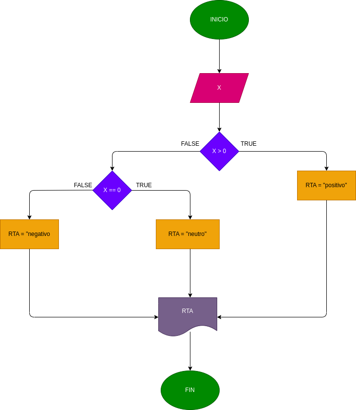

# Positivo-o-negativo
Programa para verificar si un numero es positivo o negativo

Designar si un numero se positivo o negativo dependiendo de su posicion en la tabla numerica
# Analisis
-Variable de entrada

x: Es el numero que se ingresa para determinar si es negativo o positivo

-Variable de salida
# DISEÑO

# CONSTRUCCION